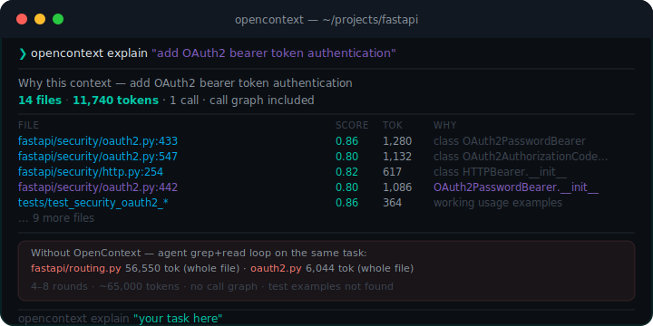
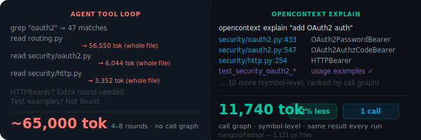
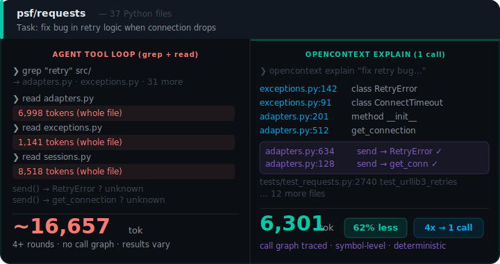
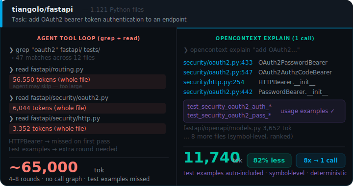

<p align="center">
  
</p>

<h1 align="center">OpenContext Runtime</h1>

<p align="center">
  <strong>Deterministic context for AI coding agents.</strong>
</p>

<p align="center">
  One call. Call-graph-traced symbols. Verified context packs.<br>
  No grep loops. No full-file reads. No opaque vector guesses.
</p>

<p align="center">
  <a href="https://pypi.org/project/opencontext-cli/"></a>
  
  
</p>

<p align="center">
  
</p>

<p align="center">
  <a href="#the-opencontext-difference">What It Does</a> ·
  <a href="#start-in-30-seconds">Quick Start</a> ·
  <a href="#proof-not-promises">Benchmarks</a> ·
  <a href="#the-context-runtime">How It Works</a> ·
  <a href="#local-code-graph">Code Graph</a> ·
  <a href="#agent-interface">MCP</a> ·
  <a href="#offline-by-default">Security</a> ·
  <a href="#installation">Install</a>
</p>

<p align="center">
  
</p>

<!-- ─────────────── THE WHOLE SYSTEM, AT A GLANCE ─────────────── -->

<div id="at-a-glance" align="center">

<table>
<tr>
<td width="760">

<h3>The whole system, at a glance</h3>

OpenContext is the layer **between your coding agent and your codebase** — it prepares verified context, runs a controlled agentic workflow, and keeps both governed. Everything below is one of these six pillars.

| Pillar | What it does |
|--------|--------------|
| **Context packs + code graph** | Call-graph-traced, token-budgeted context in one deterministic call — no grep loops, no full-file reads. |
| **Controlled SDD loop** | `explore → … → archive`, seven personas, gates and strict TDD — bounded and human-in-the-loop, not "go do everything". |
| **Your model, per persona** | Pick the model for each SDD phase in `opencontext.yaml`; it is sent to your agent as an MCP sampling hint. |
| **Persistent memory** | Local store plus co-resident Engram coexistence, with progressive, token-aware recall. |
| **Security by default** | Redaction, secret scanning, fail-closed posture, offline-first. |
| **18 MCP tools** | Search, context, call graph, impact, symbol edits, memory — inside Claude Code, OpenCode, Codex. |

</td>
</tr>
</table>

</div>

<p align="center">
  
</p>

<p align="center">
  
</p>

<p align="center">
  <sub>Real output · tiangolo/fastapi · one call replaces a multi-round grep+read loop</sub>
</p>

<p align="center">
  
</p>

<!-- ─────────────── THE OPENCONTEXT DIFFERENCE ─────────────── -->

<div id="the-opencontext-difference" align="center">

<table>
<tr>
<td width="760">

<h3>The OpenContext Difference</h3>

AI coding agents usually discover context through repeated search and full-file reads. Each file read whole. Call direction invisible. Results vary between runs.

**OpenContext builds the context before the agent starts.** Traces the call graph, ranks symbols, applies a token budget, delivers a verified pack in one deterministic call.

</td>
</tr>
</table>

</div>

<p align="center">
  
</p>

<p align="center">
  <sub>Runtime · deterministic pipeline · no LLM in the retrieval path · same result every run</sub>
</p>

<p align="center">
  
</p>

<p align="center">
  <sub>Benchmark · tiangolo/fastapi · add OAuth2 auth · far fewer tokens, one call instead of a grep/read loop</sub>
</p>

<p align="center">
  
</p>

<p align="center">
  <sub>Not a good fit: repos under ~50 files, or workflows that specifically require semantic embedding search.</sub>
</p>

<p align="center">
  
</p>

<!-- ─────────────── START IN 30 SECONDS ─────────────── -->

<div id="start-in-30-seconds" align="center">

<table>
<tr>
<td width="760">

<h3>Start in 30 Seconds</h3>

Run the demo on your actual repository, then wire OpenContext into your editor.

</td>
</tr>
</table>

</div>

<p align="center">
  
</p>

<p align="center">
  <sub>Setup · pip install → demo on your repo → editor wizard → MCP wired</sub>
</p>

<div align="center">

<table>
<tr>
<td width="760">

```bash
pip install opencontext-cli
cd your-project
opencontext demo        # real token reduction on your actual repo
opencontext install     # stack detection · editor setup · index repo
```

</td>
</tr>
</table>

</div>

<p align="center">
  
</p>

<!-- ─────────────── PROOF, NOT PROMISES ─────────────── -->

<div id="proof-not-promises" align="center">

<table>
<tr>
<td width="760">

<h3>Proof, Not Promises</h3>

Every benchmark runs on a public repository. No hidden dataset. No hosted service. No benchmark-only path. Fully reproducible with `opencontext explain`.

**Benchmark methodology:** "Agent loop" means reading full files discovered via grep-style search, without call-graph tracing. OpenContext returns one verified pack from `opencontext explain` on the same public repositories — far fewer tokens, one call instead of a grep/read loop. We make no fixed percentage claim: completeness and latency are measured directly by the honest efficiency benchmark (`opencontext benchmark`), and real agent behavior varies by model, editor, and tool strategy.

</td>
</tr>
</table>

</div>

<p align="center">
  
</p>

<p align="center">
  
</p>

<p align="center">
  <sub>Benchmark · psf/requests · retry bug · <code>send → RetryError</code> surfaced by call graph, not query text</sub>
</p>

<p align="center">
  
</p>

<p align="center">
  <sub>Benchmark · tiangolo/fastapi · OAuth2 auth · <code>routing.py</code> is 56,550 tokens — OpenContext returns only the symbols that matter</sub>
</p>

<p align="center">
  
</p>

<p align="center">
  <sub>Numbers · 4 public repos · agent loop = full files via grep, no call graph · all reproducible</sub>
</p>

<div align="center">

<table>
<tr>
<td width="760">

When a file exceeds the per-item budget, OpenContext is explicit — it never silently drops content:

```
Kept out (and why):
  ✗ django/db/models/query.py   29,532 tok — item_exceeds_available_budget
```

Pass `--max-tokens 32000` (or raise `context.max_input_tokens` in `opencontext.yaml`) to include it.

</td>
</tr>
</table>

</div>

<p align="center">
  
</p>

<!-- ─────────────── THE CONTEXT RUNTIME ─────────────── -->

<div id="the-context-runtime" align="center">

<table>
<tr>
<td width="760">

<h3>The Context Runtime</h3>

Every query runs through a deterministic pipeline. A **ContextContract** locks in the token budget, required symbols, and verification gates _before_ retrieval starts.

</td>
</tr>
</table>

</div>

<p align="center">
  
</p>

<p align="center">
  <sub>Runtime · deterministic · no LLM in retrieval · offline</sub>
</p>

<div align="center">

<table>
<tr>
<td width="760">

**Command**
```bash
opencontext contract build --query "fix crash in auth middleware"
```

**Output**
```yaml
task: fix crash in auth middleware
task_type: bugfix
risk_tier: precise
token_budget: 16000
required_symbols: ['*crash*', '*auth*', '*middleware*']
must_verify: [run-tests, lint, type-check]
```

**Risk Tiers**

| Risk Tier | Token Budget | When |
|-----------|-------------|------|
| `cheap` | 8,000 | Renames, docs, trivial fixes |
| `precise` | 16,000 | Bugfixes, features, refactors |
| `critical` | 28,000 | Security, migrations, architecture |

**AICX Bytecode**

Context packs are serialized as AICX bytecode — compact, verifiable, with a cryptographic checksum. Agents can validate integrity before acting.

```bash
opencontext bytecode compile --query "fix auth bug"
opencontext bytecode inspect
opencontext bytecode decode <path.aicx>
```

</td>
</tr>
</table>

</div>

<p align="center">
  
</p>

<!-- ─────────────── LOCAL CODE GRAPH ─────────────── -->

<div id="local-code-graph" align="center">

<table>
<tr>
<td width="760">

<h3>Local Code Graph</h3>

SQLite + FTS5, fully offline. Indexes symbols, call chains, imports, and framework routes. Python works out of the box; TypeScript, JavaScript, Go, Rust, Java, and PHP add full symbol extraction once their tree-sitter grammar is installed (`pip install tree-sitter-typescript`, etc.). Files in any language are still indexed and searchable.

</td>
</tr>
</table>

</div>

<p align="center">
  
</p>

<p align="center">
  <sub>Code Graph · 6 layers · symbol-level · cross-language bridges · offline</sub>
</p>

<div align="center">

<table>
<tr>
<td width="760">

**Real output on psf/requests**
```
Why this context — how does authentication work
20 files · 9,900 tokens

src/requests/auth.py:116     0.86  125  graph · class HTTPProxyAuth  · matched query
src/requests/auth.py:85      0.84  362  graph · class HTTPBasicAuth  · matched query
src/requests/sessions.py     0.83  385  graph · method rebuild_auth  · matched query
src/requests/models.py       0.73   81  graph · method prepare_auth  · calls:HTTPBasicAuth
docs/user/authentication.rst 0.68 1464  manifest
```

`prepare_auth → HTTPBasicAuth` surfaced from the call graph — not from the query text.

```bash
opencontext index .
opencontext explain "how does authentication work"
opencontext knowledge-graph callers "authenticate_user"
opencontext knowledge-graph impact "UserModel" --radius 2
opencontext routes scan . --framework fastapi
opencontext bridges scan . --type HTTP --json
```

</td>
</tr>
</table>

</div>

<p align="center">
  
</p>

<!-- ─────────────── AGENT INTERFACE ─────────────── -->

<div id="agent-interface" align="center">

<table>
<tr>
<td width="760">

<h3>Agent Interface</h3>

18 MCP tools. Compatible with Claude Code, Cursor, Copilot, Windsurf, OpenCode, and any MCP-compatible editor.

`opencontext install` writes seven OC personas to your editor's agents directory. In OpenCode, press **Tab** to switch to one. In Claude Code, they appear as subagents. Each SDD phase runs as the persona suited to it.

| Persona | SDD phase | Role |
|---------|-----------|------|
| **OC Orchestrator** | propose · spec · tasks | Thin coordinator: plans, delegates, and verifies through the gates. Delegates reading 4+ files, writing 2+ files, and every commit to a focused sub-step. |
| **OC Explorer** | explore | Investigates the codebase: maps the territory before any change via the knowledge graph. |
| **OC Architect** | design | Designs the technical approach: architecture, components, data flow. |
| **OC Builder** | apply | Implements the design: writes code that matches existing patterns. |
| **OC Tester** | test | Senior QA: writes behavior tests that fail when the code breaks. |
| **OC Reviewer** | verify · review | Rigorous reviewer: code review (one finding per line), quality gates, adversarial review. |
| **OC Professor** | — | Teaching mentor: explains the why and the concept before the code, grounded in your real code. |

**Multi-agent execution:** the OC Orchestrator is a thin coordinator — it never does all the work itself. Reading, writing, and verifying are always delegated to specialized sub-agents. When you run the harness (`opencontext loop`), each phase runs in its own context: explore → propose → spec → design → tasks → apply → verify → archive. Phases that can run in parallel do.

<h3>Runs on top of your agent — you choose the model per persona</h3>

OpenContext is the agentic system **on top of** your coding agent, not another agent CLI. Your agent (Claude Code, Codex, OpenCode, …) **fixes the provider**: when OpenContext needs a generation it asks your agent to run it on the agent's own model via MCP sampling — **zero provider or API-key config** on the OpenContext side.

What you control is **which model each unit of work uses** — declared in `opencontext.yaml` and sent to your agent as an MCP `modelPreferences` hint. Anything unset uses your agent's own model; nothing is chosen for you:

```yaml
# opencontext.yaml — pick the model per SDD phase (the provider is always your agent's)
models:
  phases:
    explore: { model: haiku }    # cheap where it doesn't matter
    design:  { model: opus }     # strong where it does
    apply:   { model: sonnet }
  roles:                         # optional second axis: functional ops + MCP tools
    classify: { model: haiku }
```

Two independent axes, both delivered as sampling hints: **phases** (≙ personas: Architect → design, Explorer → explore, Builder → apply, …) drive the SDD harness; **roles** (classify / retrieve / rerank / generate / …) drive the runtime and MCP tools. At install you pick a preset (`default` / `cheap` / `hybrid` / `premium`) that writes this block for you; a command shortcut also exists (`opencontext models set-persona architect opus`) — it just edits the same file. (Prefer OpenContext to run a model itself? Set a real provider per role; local providers like ollama work too.)

> **After `opencontext install`:** reload your shell (`source ~/.bashrc`) if PATH changed, then **restart your agent** so it loads the OpenContext MCP server.

</td>
</tr>
</table>

</div>

<p align="center">
  
</p>

<p align="center">
  <sub>Agent Interface · 18 MCP tools · 9 read + 4 symbol-level edits + 1 agentic run + 4 memory</sub>
</p>

<div align="center">

<table>
<tr>
<td width="760">

```bash
opencontext setup claude-code
opencontext setup cursor
opencontext setup --all
```

</td>
</tr>
</table>

</div>

<p align="center">
  
</p>

<!-- ─────────────── AGENTIC HARNESS ─────────────── -->

<div id="agentic-harness" align="center">

<table>
<tr>
<td width="760">

<h3>Agentic Harness</h3>

The execution harness runs structured multi-agent workflows. Each phase is isolated: it reads what it needs, does its work, passes gates, then hands off. No phase can skip a gate.

**Requires an LLM provider** — set `ANTHROPIC_API_KEY` or `OPENAI_API_KEY` before running.

```bash
opencontext clarify "add OAuth2 login"
opencontext loop --task "..." --flow full
opencontext loop --task "..." --flow quality
opencontext loop --task "..." --flow quick --dry-run
```

| Track | Phases | When |
|-------|--------|------|
| `quick` | explore → apply → verify | Simple fixes |
| `standard` | explore → propose → spec + design → apply → verify | Features, refactors |
| `full` | All 9 phases | Architecture, security |
| `autonomous` | All 9, no prompts | CI/CD, automation |
| `quality` | All 9 + GGA rules + judgment | Maximum quality gates |

**Phases:** `explore → propose → spec → design → tasks → apply → verify → review → archive`

The base flow ends with `review` (the final quality gate) then `archive`. The `quality` track appends an extra `judgment` phase — adversarial structural review of apply artifacts (missing files, failed gates, missing verify) — and enforces GGA rules before it.

</td>
</tr>
</table>

</div>

<p align="center">
  
</p>

<p align="center">
  <sub>SDD Workflow · 9 phases · blue = works without LLM · amber dashes = optional quality gates</sub>
</p>

<p align="center">
  
</p>

<p align="center">
  <sub>TDD Workflow · test first · implement minimum · verify green · refactor · verify again</sub>
</p>

<p align="center">
  
</p>

<!-- ─────────────── OFFLINE BY DEFAULT ─────────────── -->

<div id="offline-by-default" align="center">

<table>
<tr>
<td width="760">

<h3>Offline by Default</h3>

Knowledge graph, context packing, MCP tools, and benchmarks run without external services. Index your repo once; every query after that is local.

</td>
</tr>
</table>

</div>

<p align="center">
  
</p>

<p align="center">
  <sub>Security · 4 defaults active out of the box · no configuration required</sub>
</p>

<div align="center">

<table>
<tr>
<td width="760">

```bash
opencontext security scan .
opencontext doctor security
opencontext preset apply privacy    # air-gapped · fail-closed · no egress
```

</td>
</tr>
</table>

</div>

<p align="center">
  
</p>

<!-- ─────────────── INSTALLATION ─────────────── -->

<div id="installation" align="center">

<table>
<tr>
<td width="760">

<h3>Installation</h3>

**Requirements:** Python 3.12+

| Method | Command |
|--------|---------|
| pip | `pip install opencontext-cli` |
| pipx | `pipx install opencontext-cli` |
| uv | `uv tool install opencontext-cli` |
| Ubuntu / Debian | `curl -fsSL https://raw.githubusercontent.com/CesarMSFelipe/OpenContext-Runtime/main/install.sh \| bash` |
| macOS | `curl -fsSL https://raw.githubusercontent.com/CesarMSFelipe/OpenContext-Runtime/main/install.sh \| bash` |
| Windows (PowerShell) | `irm https://raw.githubusercontent.com/CesarMSFelipe/OpenContext-Runtime/main/install.ps1 \| iex` |
| Portable binary | `make binary` → `dist/opencontext.pyz` (Python 3.12+) |

After installing, run the setup wizard in your project:

```bash
cd your-project
opencontext install     # detects editor, writes MCP config, indexes repo
opencontext verify      # confirm all checks pass
opencontext doctor      # deep diagnostics if something looks wrong
```

`opencontext install` auto-detects Claude Code, OpenCode, Cursor, Copilot, Windsurf, and more. It writes MCP config and the seven OC personas (Orchestrator, Explorer, Architect, Builder, Tester, Reviewer, Professor) to your editor's agents directory.

</td>
</tr>
</table>

</div>

<p align="center">
  
</p>

<!-- ─────────────── LOCAL AGENT MEMORY ─────────────── -->

<div align="center">

<table>
<tr>
<td width="760">

<h3>Local Agent Memory</h3>

Five layers, SQLite + FTS5, zero external services. Past failures automatically surface first in the next run.

| Layer | Stores |
|-------|--------|
| `SEMANTIC` | Stable project facts |
| `EPISODIC` | Past task outcomes |
| `PROCEDURAL` | Learned rules |
| `WORKING` | Current task context |
| `FAILURE` | Symbols that caused test failures |

```bash
opencontext memory search "auth middleware"
opencontext memory collect
opencontext memory review
opencontext memory gc --dry-run
```

</td>
</tr>
</table>

</div>

<p align="center">
  
</p>

<!-- ─────────────── WORKFLOW SKILLS ─────────────── -->

<div align="center">

<table>
<tr>
<td width="760">

<h3>Workflow Skills</h3>

Drop `.skill.md` files in `skills/`. OpenContext injects the right ones based on file extensions and task keywords.

| Skill | Injected When |
|-------|--------------|
| `fix` | Task mentions "bug", "fix", "crash", "regression" |
| `prd` | Task is a vague idea before SDD |
| `work-unit-commits` | Any apply phase |
| `oc-onboard` | First run on a new project |

```bash
opencontext skill-registry refresh
```

</td>
</tr>
</table>

</div>

<p align="center">
  
</p>

<!-- ─────────────── RUNTIME COMMANDS ─────────────── -->

<div align="center">

<table>
<tr>
<td width="760">

<h3>Runtime Commands</h3>

```bash
# Setup
opencontext install
opencontext demo
opencontext verify  &&  opencontext doctor

# Context
opencontext explain "task"
opencontext pack . --query "task" --copy
opencontext verified-context "task"
opencontext contract build --query "task"
opencontext index .

# AICX bytecode
opencontext bytecode compile --query "task"
opencontext bytecode inspect
opencontext bytecode decode <path.aicx>

# Agentic loop & harness
opencontext clarify "idea"
opencontext loop --task "..." --flow full
opencontext loop --task "..." --flow quality --dry-run
opencontext harness run --workflow sdd --task "..."
opencontext harness list

# Code graph
opencontext knowledge-graph search "symbol"
opencontext knowledge-graph callers "func"
opencontext knowledge-graph impact "Class" --radius 2
opencontext routes scan . --framework fastapi
opencontext bridges scan . --type HTTP --json

# Memory
opencontext memory search "query"
opencontext memory collect
opencontext memory gc --dry-run

# Config & plugins
opencontext config wizard
opencontext preset apply <name>
opencontext plugin install <name> --github owner/repo
opencontext update && opencontext upgrade
opencontext security scan .
opencontext benchmark run
```

</td>
</tr>
</table>

</div>

<p align="center">
  
</p>

<!-- ─────────────── DOCS INDEX ─────────────── -->

<div align="center">

<table>
<tr>
<td width="760">

<h3>Documentation</h3>

| Area | Links |
|------|-------|
| Getting Started | [Quickstart](docs/getting-started/quickstart.md) · [Installation](docs/getting-started/installation.md) · [Troubleshooting](docs/getting-started/troubleshooting.md) |
| Architecture | [Overview](docs/architecture/overview.md) · [Context Pack Builder](docs/architecture/context-pack-builder.md) · [Safety Layer](docs/architecture/safety-layer.md) |
| Workflows | [Flow Modes](docs/workflows/modes.md) · [SDD Guide](docs/workflows/sdd-workflow.md) · [Custom Workflows](docs/workflows/custom-workflows.md) |
| Security | [Threat Model](docs/security/threat-model.md) · [Data Classification](docs/security/data-classification.md) |
| Integrations | [Python SDK](docs/integrations/python-sdk.md) · [API](docs/integrations/api.md) · [GitHub Action](docs/integrations/github-action.md) · [Air-Gapped](docs/enterprise/air-gapped.md) |
| Contributing | [CONTRIBUTING.md](CONTRIBUTING.md) · [Architecture deep-dive](docs/architecture/overview.md) |

</td>
</tr>
</table>

</div>

<br>

<p align="center">
  
</p>

<p align="center">
  <sub>MIT · <a href="LICENSE">LICENSE</a> · <a href="SECURITY.md">SECURITY.md</a> · <a href="CONTRIBUTING.md">CONTRIBUTING.md</a></sub>
</p>
