<p align="center">
  
</p>

<h1 align="center">OpenContext Runtime</h1>

<p align="center">
  <strong>Local control plane for AI software engineering agents.</strong>
</p>

<p align="center">
  Verified context · governed workflows · secure MCP tools · project memory<br>
  · quality gates · auditable receipts — across your existing coding agents.
</p>

<p align="center">
  One call. Call-graph-traced symbols. Verified context packs.<br>
  No grep loops. No whole-file read loops. No opaque vector guesses.
</p>

<p align="center">
  <a href="https://pypi.org/project/opencontext-cli/"></a>
  
  
</p>

<p align="center">
  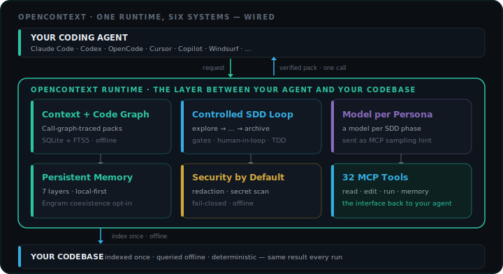
</p>

<p align="center">
  
</p>

## Product surface

The four canonical diagrams below show the user-facing surface. Each SVG is referenced by
an exact filename in this README.

### TUI Cockpit

<p align="center">
  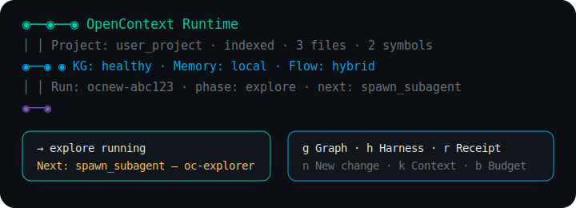
</p>

The interactive TUI cockpit — runtime state, run phase, and the next action the agent
will take, with the keyboard hints (g Graph, h Harness, r Receipt, n New change, k Context,
b Budget) that drive the four-key workflow.

### Config Menu

<p align="center">
  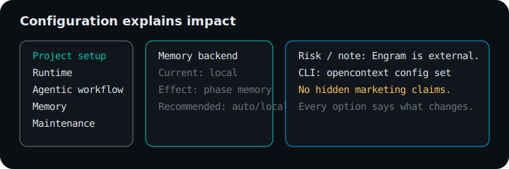
</p>

The configuration menu that explains impact before it asks for input — project setup,
runtime posture, workflow strictness, memory location, and maintenance. Each option shows
its downstream effect on a real run, not a marketing blurb.

### Graph Viewer

<p align="center">
  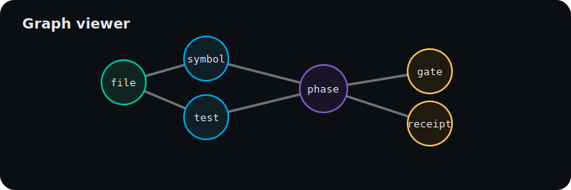
</p>

The local code-graph viewer — nodes for symbols, files, and run phases; edges for
calls, imports, and evidence. Built from the index the runtime produces during
`opencontext index`, queryable from the TUI and the CLI.

### User Flows

<p align="center">
  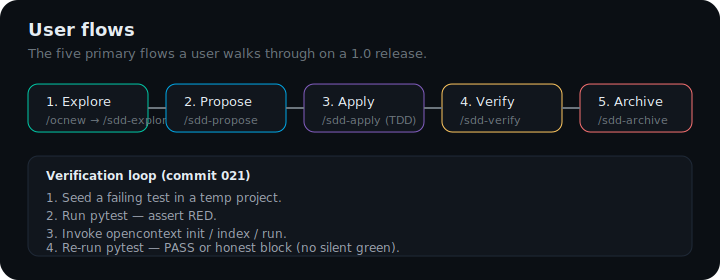
</p>

The five primary user flows: **Explore → Propose → Apply → Verify → Archive**. The bottom
panel shows the verification loop from commit 021: seed a failing test, run pytest,
invoke OpenContext, re-run pytest, and pass or honestly block.

<p align="center">
  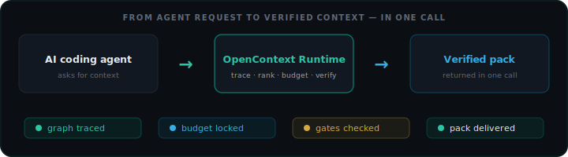
</p>

<p align="center">
  <a href="#the-opencontext-difference">What It Does</a> ·
  <a href="#start-in-30-seconds">Quick Start</a> ·
  <a href="#proof-not-promises">Benchmarks</a> ·
  <a href="#the-context-runtime">How It Works</a> ·
  <a href="#local-code-graph">Code Graph</a> ·
  <a href="#agent-interface">MCP</a> ·
  <a href="#offline-by-default">Security</a> ·
  <a href="#installation">Install</a>
</p>

<!-- ─────────────── THE WHOLE SYSTEM, AT A GLANCE ─────────────── -->

### The whole system, at a glance

OpenContext is the layer **between your coding agent and your codebase** — it prepares verified context, runs a controlled agentic workflow, and keeps both governed. Everything below is one of these six pillars.

| Pillar | What it does |
|--------|--------------|
| **Context packs + code graph** | Call-graph-traced, token-budgeted context in one deterministic call — no grep loops, no full-file reads. |
| **Controlled SDD loop** | `explore → … → archive`, a dedicated persona per phase, gates and TDD-as-mode/gate (strict / ask / off) — bounded and human-in-the-loop, not "go do everything". |
| **Your model, per persona** | Pick the model for each SDD phase in `opencontext.yaml`; it is sent to your agent as an MCP sampling hint. |
| **Persistent memory** | Local store by default (seven layers); co-resident Engram coexistence is opt-in. Progressive, token-aware recall. |
| **Security by default** | Redaction, secret scanning, fail-closed posture, offline-first. |
| **Live MCP tool registry** | 32 tools: search, context, call graph, impact, symbol edits, memory, quality, session steps, workflow/profile explain, config doctor — inside Claude Code, OpenCode, Codex. Real-host integration is proven by `real_host` e2e tests; see [Host Support](docs/HOST-SUPPORT.md). |

<p align="center">
  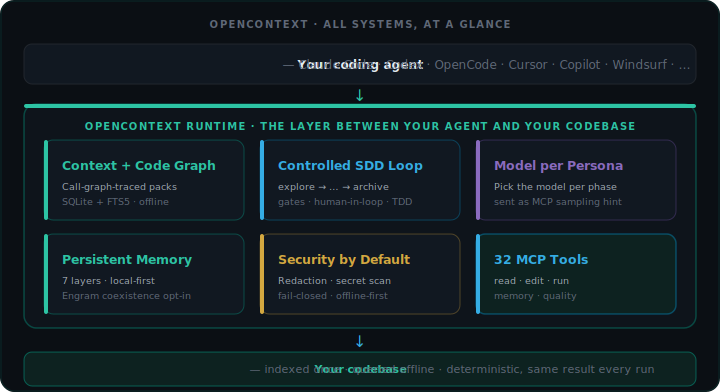
</p>

<p align="center">
  <sub>All systems · the layer between your agent and your codebase · six systems, one runtime</sub>
</p>

<!-- ─────────────── PRODUCT UI ─────────────── -->

### The runtime UI shows state, not slogans

The TUI and CLI use the same node logo as this README, then show live project
state: install/index status, KG health, memory backend, active run, current
phase, gates, and next action.

<p align="center">
  
</p>

<p align="center">
  <sub>Real recording · the mission cockpit — live project state, then new change · graph · memory · budget · harness · doctor</sub>
</p>

<p align="center">
  
</p>

<p align="center">
  <sub>Real recording · configuration that explains impact — current value · effect · recommendation · risk · CLI equivalent</sub>
</p>

<p align="center">
  
</p>

<p align="center">
  <sub>Real recording · walk the knowledge graph from the terminal — focus a node, see its calls (→) and callers (←), <code>Enter</code> to drill in, <code>Backspace</code> to go back (press <code>g</code> in the cockpit · no browser)</sub>
</p>

<!-- ─────────────── OFFLINE VS MODEL ─────────────── -->

### What runs offline — and what needs a model

OpenContext separates **local context operations** (always offline, deterministic — no LLM in the retrieval path) from **generative work** (new code, specs, designs, patches, reviews). Generative work requires a **generative executor** — an LLM provider, local model, or MCP host model.

<p align="center">
  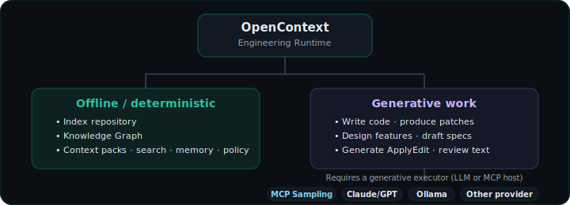
</p>

<p align="center">
  <sub>Runtime boundary · OpenContext governs and verifies · generation needs a model-capable executor</sub>
</p>

| Capability | Needs a model? | How it runs |
|---|---|---|
| Index, code graph, context packs, `explain`, `pack`, search, impact, routes, AICX bytecode | **No** | Fully offline, deterministic — same result every run |
| MCP read tools, the quality tool, memory search/context | **No** | Local MCP server over the indexed repo — deterministic |
| MCP `opencontext_run` (in-process agentic run) | **Host agent's model** | Via MCP sampling — your agent runs it on its own model; zero provider or API-key config on the OpenContext side |
| Standalone `opencontext loop` / `harness run` generative phases (spec, design, apply, …) | **Yes** | A configured provider or local model (e.g. ollama). Without one the harness stays **honest planned-only** — it emits a structured plan for your agent to complete; it never fakes a result |

<p align="center">
  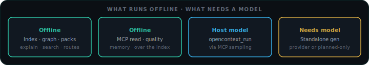
</p>

<p align="center">
  <sub>Offline by default · only generative phases need a model · <code>opencontext_run</code> borrows the host agent's model via sampling</sub>
</p>

<!-- ─────────────── THE OPENCONTEXT DIFFERENCE ─────────────── -->

### The OpenContext Difference

AI coding agents usually discover context through repeated search and full-file reads. Each file read whole. Call direction invisible. Results vary between runs.

**OpenContext builds the context before the agent starts.** Traces the call graph, ranks symbols, applies a token budget, delivers a verified pack in one deterministic call.

<p align="center">
  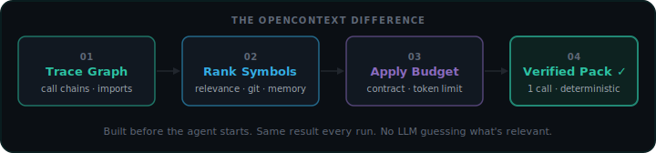
</p>

<p align="center">
  <sub>Runtime · deterministic pipeline · no LLM in the retrieval path · same result every run</sub>
</p>

<p align="center">
  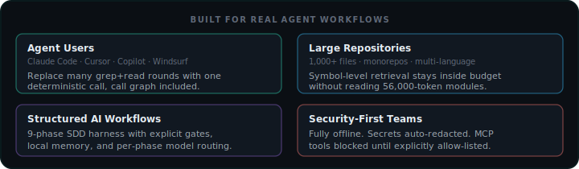
</p>

<p align="center">
  <sub>Not a good fit: repos under ~50 files, or workflows that specifically require semantic embedding search.</sub>
</p>

<!-- ─────────────── START IN 30 SECONDS ─────────────── -->

### Start in 30 Seconds

Run the demo on your actual repository, then wire OpenContext into your editor.

<p align="center">
  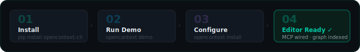
</p>

<p align="center">
  <sub>Setup · installer script or pipx → demo on your repo → editor wizard → MCP wired</sub>
</p>

**Linux / Ubuntu / macOS**

```bash
curl -fsSL https://raw.githubusercontent.com/CesarMSFelipe/OpenContext-Runtime/main/install.sh | bash
cd your-project
opencontext install            # stack detection · editor setup · index repo
opencontext demo               # see the call-graph-traced, verified context pack for a task
```

**Windows PowerShell**

```powershell
irm https://raw.githubusercontent.com/CesarMSFelipe/OpenContext-Runtime/main/install.ps1 | iex
cd your-project
opencontext install
opencontext demo
```

Prefer Python tooling? Use `pipx install opencontext-cli` instead.

<p align="center">
  
</p>

<p align="center">
  <sub>Real recording · <code>opencontext install</code> — stack detection · editor setup · repo indexed</sub>
</p>

<!-- ─────────────── PROOF, NOT PROMISES ─────────────── -->

### Proof, Not Promises

Every benchmark runs on a public repository. No hidden dataset. No hosted service. No benchmark-only path. Fully reproducible with `opencontext pack` (see [`docs/benchmarks/`](docs/benchmarks/) for the exact commands and pinned commits).

**What you get, in one call:** call-graph-traced context — the symbols that actually reach your task, ranked, with the files it left out listed explicitly (it never silently drops content). Deterministic: the same pinned commit and query produce the same pack every run, reproducible on public repos at pinned commits (see [`docs/benchmarks/`](docs/benchmarks/) for the exact commands).

**On packing size:** each case clones a public repo at a pinned commit, runs `opencontext index`, then compares OpenContext's one-call pack against reading the relevant files whole — the same token counter on both sides. The relevant symbol-level pack is **42–87% smaller** than opening those files whole (psf/requests, tiangolo/fastapi, django/django). That is a context-packing measurement, **not** an end-to-end token, latency, or task-success win — on a small surgical edit, a targeted file read can cost fewer tokens than a full pack. Reach for OpenContext when you want verified context and impact analysis on a large repo, not as a blanket token-saver. Full numbers, pinned commits, and a one-command reproduction live in [`docs/benchmarks/`](docs/benchmarks/).

<p align="center">
  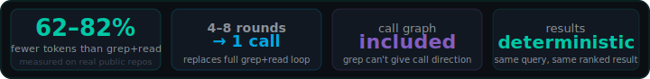
</p>

<p align="center">
  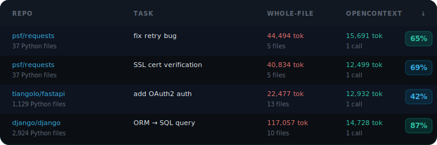
</p>

<p align="center">
  <sub>Numbers · 3 public repos · OpenContext pack vs reading the relevant files whole · reproducible — see <code>docs/benchmarks/</code></sub>
</p>

When a file exceeds the per-item budget, OpenContext is explicit — it never silently drops content:

```
Kept out (and why):
  ✗ django/db/models/query.py   29,767 tok — item_exceeds_available_budget
```

Pass `--max-tokens 32000` (or raise `context.max_input_tokens` in `opencontext.yaml`) to include it.

<p align="center">
  
</p>

<p align="center">
  <sub>Real recording · nothing is silently dropped — every omission is reported with its reason</sub>
</p>

<!-- ─────────────── THE CONTEXT RUNTIME ─────────────── -->

### The Context Runtime

Every query runs through a deterministic pipeline. A **ContextContract** locks in the token budget, required symbols, and verification gates _before_ retrieval starts.

<p align="center">
  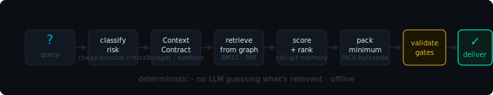
</p>

<p align="center">
  <sub>Runtime · deterministic · no LLM in retrieval · offline</sub>
</p>

**Command**
```bash
opencontext contract build --query "fix crash in auth middleware"
```

**Output**
```yaml
task: fix crash in auth middleware
task_type: bugfix
risk_tier: precise
token_budget: 16000
required_symbols:
- '*crash*'
- '*auth*'
- '*middleware*'
must_verify:
- id: run-tests
  required: true
- id: lint
  required: true
- id: type-check
  required: true
```

**Risk Tiers**

| Risk Tier | Token Budget | When |
|-----------|-------------|------|
| `cheap` | 8,000 | Renames, docs, trivial fixes |
| `precise` | 16,000 | Bugfixes, features, refactors |
| `critical` | 28,000 | Security, migrations, architecture |

**AICX Bytecode**

Context packs are serialized as AICX bytecode — compact, verifiable, with a cryptographic checksum. Agents can validate integrity before acting.

```bash
opencontext bytecode compile --query "fix auth bug"
opencontext bytecode inspect
opencontext bytecode decode
```

<!-- ─────────────── LOCAL CODE GRAPH ─────────────── -->

### Local Code Graph

SQLite + FTS5, fully offline. Indexes symbols, call chains, imports, and framework routes. Python, JavaScript, and TypeScript work out of the box (bundled grammars); Go, Rust, Java, PHP, C, C++, Ruby, Swift, and Kotlin add full symbol extraction once their tree-sitter grammar is installed (`pip install tree-sitter-go`, etc.). Files in any language are still indexed and searchable.

<p align="center">
  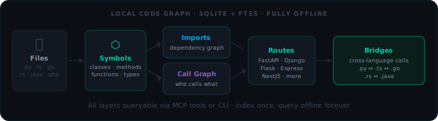
</p>

<p align="center">
  <sub>Code Graph · 6 layers · symbol-level · cross-language bridges · offline</sub>
</p>

<p align="center">
  
</p>

<p align="center">
  <sub>Real recording · <code>opencontext explain "how does authentication work"</code> — ranked symbols, call-graph traced, one deterministic call</sub>
</p>

Symbols are surfaced from the **call graph**, not just the query text — a caller is pulled in because it *calls* a matched symbol (the way `prepare_auth` links in `HTTPBasicAuth`), so you get what the code actually depends on, not only string matches.

> **Call-graph scope**: call edges are extracted via tree-sitter for Python, JavaScript, TypeScript (bundled), and Go, Rust, Java, PHP, C, C++, Ruby, Swift, Kotlin (optional — `pip install tree-sitter-<lang>`). For languages without a loaded tree-sitter grammar the index falls back to regex symbol extraction (no call edges); context packs for those files are query-match ranked only, not call-graph traced.

```bash
opencontext index .
opencontext explain "how does authentication work"
opencontext knowledge-graph callers "authenticate_user"
opencontext knowledge-graph impact "UserModel" --radius 2
opencontext routes scan . --framework fastapi
opencontext bridges scan . --type HTTP --json
```

<!-- ─────────────── AGENT INTERFACE ─────────────── -->

### Agent Interface

The MCP tool registry is generated from the live server. OpenContext ships adapters for 20+ agent clients (Claude Code, OpenCode, Cursor, Copilot, Windsurf, Codex, Gemini CLI, Zed, Aider, Cline, and more). Support level varies by client — some get MCP + instruction files, others get documented setup patterns.

`opencontext install` writes the **three public OC personas** — Orchestrator, Professor, Reviewer — to your editor's agents directory as switchable subagents (in OpenCode press **Tab**; in Claude Code they appear as subagents), plus **twelve hidden delegation personas** the harness adopts automatically. Each SDD phase runs as the persona suited to it:

| Phase | Persona | Role |
|-------|---------|------|
| `explore` | **OC Explorer** | Maps the territory via the knowledge graph before any change. |
| `propose` | **OC Orchestrator** *(public)* | Thin coordinator: plans, delegates, and verifies through the gates. |
| `spec` | **OC Requirements** | Turns intent into verifiable MUST/SHALL requirements with GIVEN/WHEN/THEN. |
| `design` | **OC Architect** | Designs the technical approach: architecture, components, data flow. |
| `tasks` | **OC Planner** | Decomposes the design into atomic, verifiable tasks. |
| `apply` | **OC Builder** | Implements the design: code that matches existing patterns. |
| `test` | **OC Tester** | Writes behavior tests that fail when the code breaks. |
| `verify` | **OC Harness Verifier** | Runs the configured gates; records outcomes, never patches around them. |
| `review` | **OC Reviewer** *(public)* | Rigorous review — one finding per line, quality gates, adversarial pass. |
| `archive` | **OC Archivist** | Closes verified work: writes the receipt, harvests memory, proposes learning signals. |

**OC Professor** *(public)* is the standalone teaching persona — it explains the why before the code and is not tied to a phase. Specialist delegates (Security Reviewer, Diagnostician, Context Engineer, Evolution Steward) are invoked as needed.

**Multi-agent execution:** the OC Orchestrator is a thin coordinator — it never does all the work itself. Reading, writing, and verifying are always delegated to specialized sub-agents. When you run the harness, each phase runs in its own context: explore → propose → spec → design → tasks → apply → verify → review → archive. Phases that can run in parallel do.

### Runs on top of your agent — you choose the model per persona

OpenContext is the agentic system **on top of** your coding agent, not another agent CLI. Your agent (Claude Code, Codex, OpenCode, …) **fixes the provider**: when OpenContext needs a generation it asks your agent to run it on the agent's own model via MCP sampling — **zero provider or API-key config** on the OpenContext side.

What you control is **which model each unit of work uses** — declared in `opencontext.yaml` and sent to your agent as an MCP `modelPreferences` hint. Anything unset uses your agent's own model; nothing is chosen for you:

```yaml
# opencontext.yaml — pick the model per SDD phase (the provider is always your agent's)
models:
  phases:
    explore: { model: haiku }    # cheap where it doesn't matter
    design:  { model: opus }     # strong where it does
    apply:   { model: sonnet }
  roles:                         # optional second axis: functional ops + MCP tools
    classify: { model: haiku }
```

Two independent axes, both delivered as sampling hints: **phases** (≙ personas: Architect → design, Explorer → explore, Builder → apply, …) drive the SDD harness; **roles** (classify / retrieve / rerank / generate / …) drive the runtime and MCP tools. At install you pick a preset (`default` / `cheap` / `hybrid` / `premium`) that writes this block for you; a command shortcut also exists (`opencontext models set-persona architect opus`) — it just edits the same file. (Prefer OpenContext to run a model itself? Set a real provider per role; local providers like ollama work too.)

> **After `opencontext install`:** reload your shell (`source ~/.bashrc`) if PATH changed, then **restart your agent** so it loads the OpenContext MCP server.

<p align="center">
  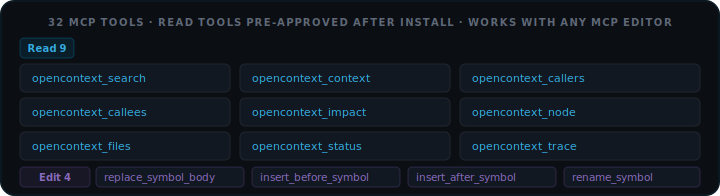
</p>

<p align="center">
  <sub>Agent Interface · live MCP registry · read + edit + run + memory + quality + session + workflow/profile + doctor tools</sub>
</p>

```bash
opencontext setup claude-code
opencontext setup cursor
opencontext setup --all
```

<!-- ─────────────── AGENTIC HARNESS ─────────────── -->

### Agentic Harness

The execution harness runs structured multi-agent workflows. Each phase is isolated: it reads what it needs, does its work, passes gates, then hands off. No phase can skip a gate.

**OpenContext is not an LLM.** It is an engineering runtime: it finds context, plans the flow, applies policy, writes receipts, and verifies results. New code, specs, designs, or patches still need a **generative executor** — either the host agent via MCP sampling or a configured provider/local model.

**SDD generative phases** work the same way at a larger scale. `spec`, `design`, `tasks`, and code-producing `apply` need text/code generation. Without an executor, standalone runs stay honest planned-only — they emit the plan and stop.

Inside an MCP host, `opencontext_run` uses the host agent's model via sampling — no key needed. Standalone (`opencontext loop` / `harness run`) needs a configured provider or local model.

```bash
opencontext clarify "add OAuth2 login"
opencontext loop --task "..." --flow full
opencontext loop --task "..." --flow quality
opencontext loop --task "..." --flow quick --dry-run
```

| Track | Phases | When |
|-------|--------|------|
| `quick` | explore → apply → verify | Simple fixes |
| `standard` | explore → propose → spec + design → apply → verify | Features, refactors |
| `full` | All 9 phases | Architecture, security |
| `autonomous` | All 9, no prompts | CI/CD, automation |
| `quality` | All 9 + GGA rules + judgment | Maximum quality gates |

**Phases:** `explore → propose → spec → design → tasks → apply → verify → review → archive`

The base flow ends with `review` (the final quality gate) then `archive`. The `quality` track appends an extra `judgment` phase — adversarial structural review of apply artifacts (missing files, failed gates, missing verify) — and enforces GGA rules before it.

<p align="center">
  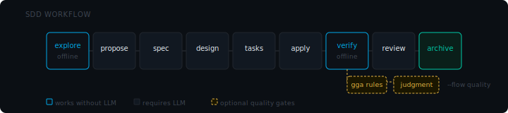
</p>

<p align="center">
  <sub>SDD Workflow · 9 phases · blue = works without LLM · amber dashes = optional quality gates</sub>
</p>

<p align="center">
  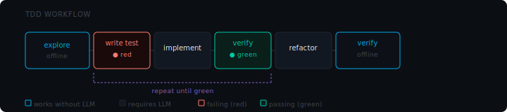
</p>

<p align="center">
  <sub>TDD as mode/gate (strict · ask · off) · failing test before mutation · not a standalone workflow</sub>
</p>

<p align="center">
  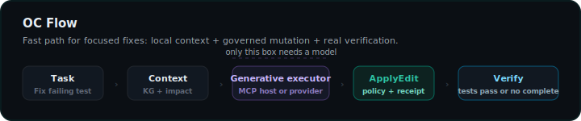
</p>

<p align="center">
  <sub>OC Flow · focused fixes · only generation needs a model · policy + receipts + tests stay governed</sub>
</p>

**OC Flow** is the fast path behind `opencontext run` for localized work such as “fix this failing test”. It builds the context, chooses the small mutation path, asks a generative executor for a structured `ApplyEdit`, blocks unsafe edits, applies behind a checkpoint, then runs verification. If no executor exists, it returns `needs_executor`; it does not invent a patch or fake completion.

Before anything executes, `opencontext run` briefs you: the execution plan, the node spine, the evidence artifacts it will produce, the gates that will judge the run, a cost estimate, and live subsystem status — then asks. Every option carries the same detail card the config TUI uses (current · effect · recommendation · risk · CLI equivalent).

<p align="center">
  
</p>

<p align="center">
  <sub>Real recording · the run preflight — plan · spine · gates · cost · subsystems, then Proceed / change workflow / change lane / cancel. No model in the sandbox → the honest <code>needs_executor</code> answer, never a fake patch</sub>
</p>

<!-- ─────────────── OFFLINE BY DEFAULT ─────────────── -->

### Offline by Default

Knowledge graph, context packing, MCP tools, and benchmarks run without external services. Index your repo once; every query after that is local.

<p align="center">
  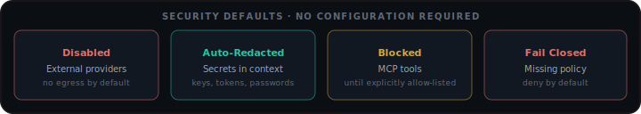
</p>

<p align="center">
  <sub>Security · 4 defaults active out of the box · no configuration required</sub>
</p>

```bash
opencontext security scan .
opencontext doctor security
opencontext preset apply privacy    # air-gapped · fail-closed · no egress
```

<!-- ─────────────── INSTALLATION ─────────────── -->

### Installation

**Requirements:** Python 3.12+

| Platform / preference | Command |
|---|---|
| Linux / Ubuntu / macOS | `curl -fsSL https://raw.githubusercontent.com/CesarMSFelipe/OpenContext-Runtime/main/install.sh \| bash` |
| Windows PowerShell | `irm https://raw.githubusercontent.com/CesarMSFelipe/OpenContext-Runtime/main/install.ps1 \| iex` |
| Python tooling | `pipx install opencontext-cli` |
| Plain pip | `pip install opencontext-cli` |

`pipx` is still the recommended Python-native install because it is isolated and always on PATH. More options (`uv`, source install, portable `.pyz`) are in the [installation guide](docs/getting-started/installation.md).

After installing, run the setup wizard in your project:

```bash
cd your-project
opencontext install     # detects editor, writes MCP config, indexes repo
opencontext verify      # confirm all checks pass
opencontext doctor      # deep diagnostics if something looks wrong
```

`opencontext install` auto-detects Claude Code, OpenCode, Cursor, Copilot, Windsurf, and more. It writes MCP config, the three public OC personas (Orchestrator, Professor, Reviewer), and twelve hidden delegation subagents to your editor's agents directory.

<!-- ─────────────── LOCAL AGENT MEMORY ─────────────── -->

### Local Agent Memory

Seven layers, SQLite + FTS5, zero external services. Past failures automatically surface first in the next run.

| Layer | Stores |
|-------|--------|
| `SEMANTIC` | Stable project facts |
| `EPISODIC` | Past task outcomes |
| `PROCEDURAL` | Learned rules |
| `WORKING` | Current task context |
| `FAILURE` | Symbols that caused test failures |
| `PROJECT` | Durable project-level facts and memory files |
| `HARNESS_EXPERIENCE` | Outcomes carried forward from harness runs |

```bash
opencontext memory search "auth middleware"
opencontext memory collect
opencontext memory review
opencontext memory gc --dry-run
```

<!-- ─────────────── WORKFLOW SKILLS ─────────────── -->

### Workflow Skills

Drop `.skill.md` files in `skills/`. OpenContext injects the right ones based on file extensions and task keywords.

| Skill | Injected When |
|-------|--------------|
| `fix` | Task mentions "bug", "fix", "crash", "regression" |
| `prd` | Task is a vague idea before SDD |
| `work-unit-commits` | Any apply phase |
| `oc-onboard` | First run on a new project |

```bash
opencontext skill-registry refresh
```

<!-- ─────────────── RUNTIME COMMANDS ─────────────── -->

### Core commands

The everyday commands, grouped by layer. The full surface (40+ commands) lives in the [CLI reference](docs/reference/cli.md).

| Layer | Main commands | When |
|-------|---------------|------|
| Setup | `install` · `setup` · `verify` · `doctor` | First run + agent integration |
| Context | `explain` · `pack` · `verified-context` · `contract` | Before coding |
| Code graph | `index` · `knowledge-graph` · `routes` · `bridges` | Understand impact |
| Agent loop | `clarify` · `loop` · `harness run` | Structured SDD/TDD workflows |
| MCP | `mcp` · `agent-context` | Agent integrations |
| Governance | `security` · `privacy` · `prompt` · `release` · `ci-check` | Safe usage + CI |
| Memory | `memory` | Reuse project knowledge |
| Optimization | `benchmark` · `tokens` · `bytecode` | Measure + reduce context cost |

Run `opencontext` with no arguments for the navigable menu — settings and tools in one place, no flags. Requires an interactive terminal; in non-interactive environments (CI, pipes) use `opencontext config show` instead.

<!-- ─────────────── STATUS, LIMITS & CLAIMS ─────────────── -->

### Maturity &amp; status

Production-oriented local runtime. The context, code-graph, MCP, and memory paths are implemented and exercised by the test suite. Some capabilities are scaffolded or fail-closed by design and must be explicitly enabled by policy. Certification-grade enterprise posture is not claimed.

| Status | Examples |
|--------|----------|
| **Stable** | Index, code graph, context packs, MCP read tools, local memory |
| **Opt-in** | Engram memory coexistence, external LLM providers, MCP symbol-edit tools, semantic/vector search |
| **Host-agent dependent** | `opencontext_run` and standalone generative phases — need the host model (MCP sampling) or a configured provider |
| **Scaffolded / fail-closed** | Network egress, tool forwarding, raw-trace storage — denied unless policy enables them |

<p align="center">
  
</p>

<p align="center">
  <sub>Real recording · <code>opencontext uninstall</code> — dry-run preview, then a clean removal that leaves no residue</sub>
</p>

### Known limitations

- Best on repos above ~50 files; tiny repos see little benefit.
- Full symbol extraction: Python, JavaScript, and TypeScript work out of the box (bundled grammars). Go, Rust, Java, PHP, C, C++, Ruby, Swift, and Kotlin require `pip install tree-sitter-<lang>`. Files in any language are still indexed and searchable.
- Standalone generative phases need a provider or local model; without one they run planned-only.
- No semantic/embedding search by default — deterministic graph + FTS only. A deliberate choice, not an oversight.
- Windows is exercised in CI but is not the primary development target.

### README claims are tested

The quantified claims here are guarded by end-to-end smoke tests that drive the real CLI/SDK — no mocks:

```bash
pytest tests/smoke/test_readme_claims.py -v
```

They check the contract risk tiers and token budgets, the AICX bytecode round-trip, the loop dry-run phases, the SDK contract, and that the README's MCP-tool count matches the running server. The benchmark numbers are real — measured on public repos at pinned commits and reproducible per [`docs/benchmarks/`](docs/benchmarks/).

<!-- ─────────────── DOCS INDEX ─────────────── -->

### Documentation

| Area | Links |
|------|-------|
| Getting Started | [Quickstart](docs/getting-started/quickstart.md) · [Installation](docs/getting-started/installation.md) · [Troubleshooting](docs/getting-started/troubleshooting.md) |
| Reference | [CLI commands](docs/reference/cli.md) |
| Configuration | [TUI Menu](docs/configuration/tui-menu.md) · [Walkthrough](docs/configuration/walkthrough.md) · [Reference](docs/configuration/reference.md) · [User Config](docs/configuration/user-config.md) |
| Architecture | [Overview](docs/architecture/overview.md) · [Context Pack Builder](docs/architecture/context-pack-builder.md) · [Safety Layer](docs/architecture/safety-layer.md) |
| Workflows | [Flow Modes](docs/workflows/modes.md) · [SDD Guide](docs/workflows/sdd-workflow.md) · [Custom Workflows](docs/workflows/custom-workflows.md) |
| Security | [Threat Model](docs/security/threat-model.md) · [Data Classification](docs/security/data-classification.md) |
| Integrations | [Python SDK](docs/integrations/python-sdk.md) · [API](docs/integrations/api.md) · [GitHub Action](docs/integrations/github-action.md) · [Air-Gapped](docs/enterprise/air-gapped.md) |
| Contributing | [CONTRIBUTING.md](CONTRIBUTING.md) · [Architecture deep-dive](docs/architecture/overview.md) |

<br>

<p align="center">
  
</p>

<p align="center">
  <sub>MIT · <a href="LICENSE">LICENSE</a> · <a href="SECURITY.md">SECURITY.md</a> · <a href="CONTRIBUTING.md">CONTRIBUTING.md</a></sub>
</p>
